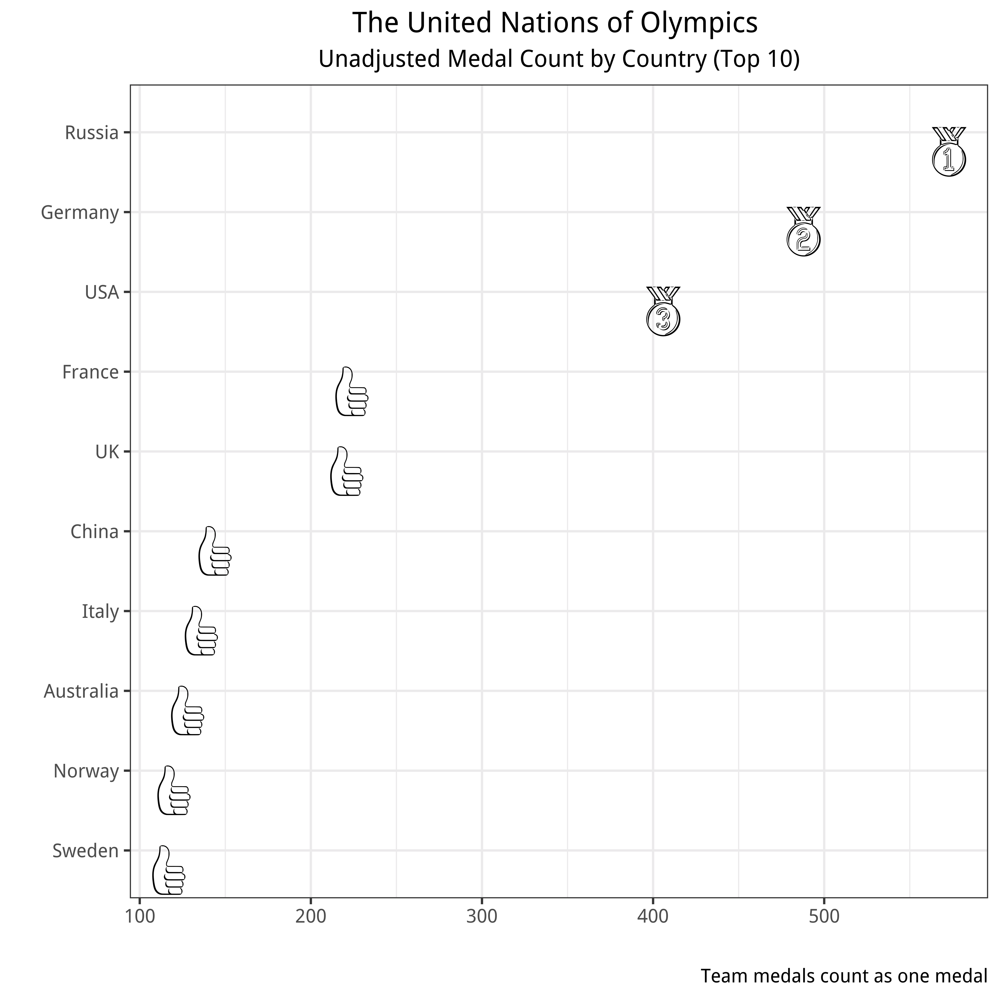
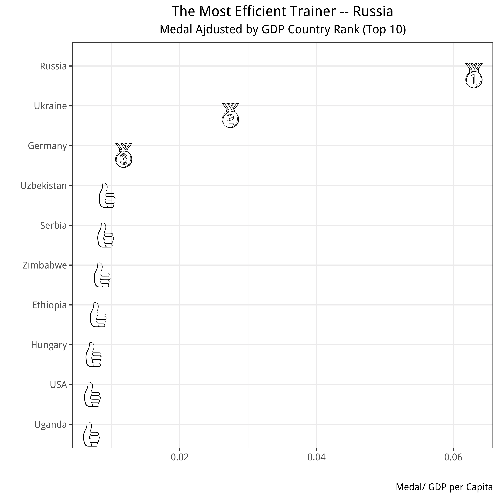
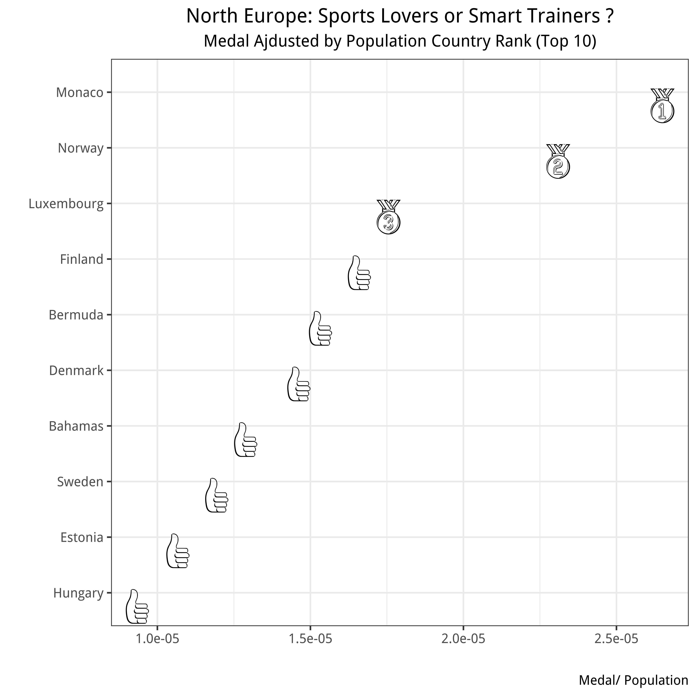
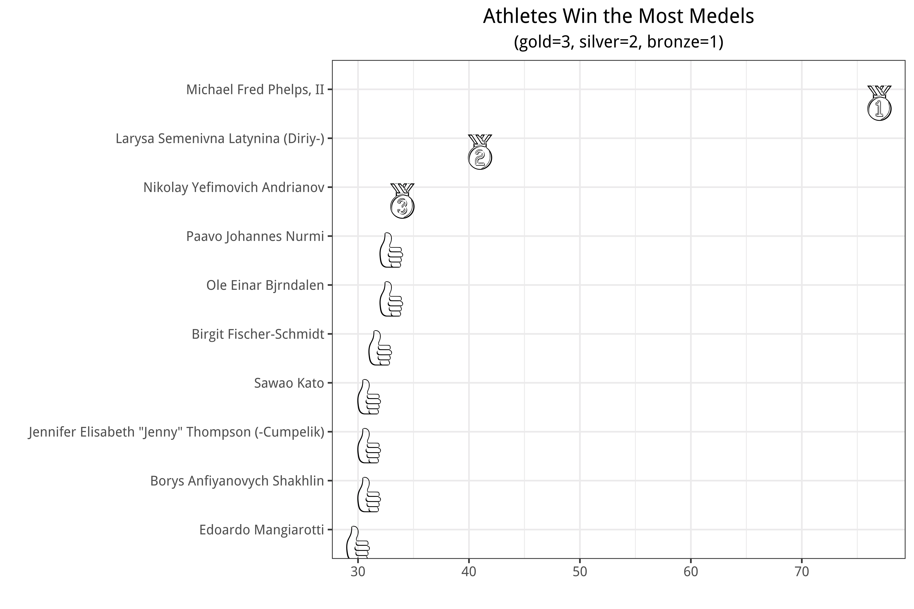

```{r Setup, include=FALSE, results='hide', warning=FALSE}
library(knitr)
opts_chunk$set(fig.path="figures/",
               cache.path="cache/",
               cache=FALSE,
               echo=TRUE,
               message=FALSE,
               warning=FALSE)  
```  

# 1. Medal Counts over Time
```{r}
library(tidyverse)
library(emojifont)
library(plotly)

```

## a. Combine the information in the three spreadsheets

Desicion: keep the defunct countries, left gdp data as blank

```{r}
event <- read_csv("athletes_and_events.csv")
region <- read_csv("noc_regions.csv")
gdp <- read_csv("gdp_pop.csv")
gdp<-dplyr::rename(gdp,NOC = Code)
region_gdp <-left_join(region, gdp)
three <- left_join(event, region_gdp)
```

b. Calculate a summary of how many summer games each country competed in,
and how many medals of each type the country won. 

```{r}
by_country <- three%>%select(Country, Event, Medal)%>%
        group_by(Country)

        
count_country <- by_country%>%
        mutate(medal_count = ifelse(is.na(Medal),0,1))%>%     
                summarise(n_game = n(), n_medal = sum(medal_count))
                

```


Use that summary to provide a visual comparison of medal count by country
```{r}

medals<-count_country%>%
        na.omit()%>%
        top_n(10, n_medal)%>%
        ggplot(aes(y= n_medal, x=reorder(Country, n_medal)))+
        geom_bar(stat = "identity")+coord_flip()+
        labs(title = "Medal Count by Country (Top 10)",
             x="", y="")+
        theme_bw(base_size = 12, base_family = "Palatino")+
        theme(plot.title = element_text(hjust = 0.5))
ggplotly(medals)

```


Bonus Point: Currently, the medal data contains information on each athlete competing, including for team events. For example, in 2016 China received 12 gold medals for their women’s win in volleyball alone. Since this is usually not how it is done in official medal statistics, try to wrangle the data so that team events are counted as a single medal.

```{r}

by_countem <- three%>%select(Country, Event, Medal)%>%
        group_by(Country)%>%
        distinct(Country,Event,.keep_all=TRUE)%>%
        mutate(medal_count = ifelse(is.na(Medal),0,1))%>%     
                summarise(n_game = n(), n_medal = sum(medal_count))

by_countem%>%
        na.omit()%>%
        top_n(10, n_medal)%>%
        ggplot(aes(y= n_medal, x=reorder(Country, n_medal)))+
        geom_bar(stat = "identity")+coord_flip()+
        labs(x = "", y="",
             title = "Medal Count by Country (Top 10)", 
             caption = "Team medals count as one medal")+
        theme_bw(base_size = 12, base_family = "Palatino")+
        theme(plot.title = element_text(hjust = 0.5))
```


## 2. Medal Counts adjusted by Population, GDP

- Create an index in which medals are valued differently. (gold=3, silver=2, bronze=1).

```{r}

index <- three%>%select(NOC, Event, Medal)%>%
        group_by(NOC)%>%
        distinct(NOC,Event,.keep_all=TRUE)%>%
        mutate(medal_count = case_when(Medal == "Gold" ~ 3,
                                       Medal == "Silver" ~ 2,
                                       Medal == "Bronze" ~ 1,
                                       TRUE ~ 0))%>%     
                summarise(n_game = n(), 
                          n_medal =sum(medal_count))%>%
        left_join(region_gdp)%>%
        replace_na(list(Population = 0, `GDP per Capita` = 0))
```

```{r, eval = FALSE}

# un_rank:
rank<-index%>%group_by(region)%>%
        summarise(unadjusted = sum(n_medal),
                   adj_gdp =sum(n_medal)/sum(`GDP per Capita`),
                  adj_pop = sum(n_medal)/sum(Population))

emoji_label<-c(emoji("1st_place_medal"),
               emoji("2nd_place_medal"),
               emoji("3rd_place_medal"),
               rep(emoji("thumbsup"),7)) 

list.emojifonts()
load.emojifont("EmojiOne.ttf")


unadjusted<-rank%>%select(region,unadjusted)%>%
        arrange(desc(unadjusted))%>%
        slice(1:10)%>%
        bind_cols(as_tibble(emoji_label))%>%
        ggplot(aes(x=reorder(region,unadjusted), 
                   y= unadjusted,
                   label = value))+
        geom_text(family="EmojiOne", size=10)+
        coord_flip()+
        labs(x = "", y="",
             title = "The United Nations of Olympics ",
             subtitle = "Unadjusted Medal Count by Country (Top 10)", 
             caption = "Team medals count as one medal")+
        theme_bw(base_size = 12, base_family = "Palatino")+
        theme(plot.title = element_text(hjust = 0.5),
              plot.subtitle = element_text(hjust = 0.5))

pdf("./figures/unadjusted.pdf", width=7, height=7)
unadjusted
dev.off()
               
quartz()
gdp<-rank%>%select(region,adj_gdp)%>%filter(is.finite(adj_gdp))%>%
        arrange(desc(adj_gdp))%>%slice(1:10)%>%
        bind_cols(as_tibble(emoji_label))%>%
        ggplot(aes(x=reorder(region,adj_gdp), 
                   y= adj_gdp,
                   label = value))+
        geom_text(family="EmojiOne", size=10)+
        coord_flip()+
        labs(x = "", y="",
             title = "The Most Efficient Trainer -- Russia",
             subtitle = "Medal Ajdusted by GDP Country Rank (Top 10)",
             caption = "Medal/ GDP per Capita")+
        theme_bw(base_size = 12, base_family = "Palatino")+
        theme(plot.title = element_text(hjust = 0.5),
              plot.subtitle = element_text(hjust = 0.5))

pdf("./figures/gdp.pdf", width=7, height=7)
gdp
dev.off()
             

pop<-rank%>%select(region,adj_pop)%>%filter(is.finite(adj_pop))%>%
        arrange(desc(adj_pop))%>%slice(1:10)%>% bind_cols(as_tibble(emoji_label))%>%
        ggplot(aes(x=reorder(region,adj_pop), 
                   y= adj_pop,
                   label = value))+
        geom_text(family="EmojiOne", size=10)+
        coord_flip()+
        labs(x = "", y="",
             title = "North Europe: Sports Lovers or Smart Trainers ?",
             subtitle = "Medal Ajdusted by Population Country Rank (Top 10)",
             caption = "Medal/ Population")+
        theme_bw(base_size = 12, base_family = "Palatino")+
        theme(plot.title = element_text(hjust = 0.5),
              plot.subtitle = element_text(hjust = 0.5))

pdf("./figures/pop.pdf", width=7, height=7)
pop
dev.off()

        
```

```{r, echo=FALSE, fig.align = 'center', fig.cap="Unajusted", out.width = '60%'}

```

```{r, echo=FALSE, fig.align = 'center', fig.cap="Ajusted by GDP", out.width = '60%'}

```


```{r, echo=FALSE, fig.align = 'center', fig.cap="Ajusted by Population", out.width = '60%'}

```

## 3. Host Country Advantage

```{r}
library(rvest)
library(stringr)
wiki_hosts <- read_html("https://en.wikipedia.org/wiki/Summer_Olympic_Games")
hosts <- html_table(html_nodes(wiki_hosts, "table")[[8]], fill=TRUE)
hosts <- hosts[-1,1:3]
hosts$City <- str_split_fixed(hosts$Host, n=2, ",")[,1]
hosts$Country <- str_split_fixed(hosts$Host, n=2, ",")[,2]
hosts$Year <- as.numeric(hosts$Year)
hosts$Country <-trimws(hosts$Country, "l")
hosts$Country[33] <-"France"
hosts$Country[34] <-"United States"
```


```{r}
host_eff <- left_join(event,hosts)

player_host<-three%>%
        select(Event, Medal, Country, City, Year)%>%
        rename(play_country = Country)%>%
        left_join(hosts)%>%
        rename(host_country = Country)%>%
        select(-Olympiad, -Host)%>%
        filter(play_country%in%host_country)%>%
        mutate(is_host = ifelse(play_country==host_country,1,0))%>%
        group_by(play_country, Year)%>%
        distinct(play_country,Event,.keep_all=TRUE)%>%
        mutate(medal_count = case_when(Medal == "Gold" ~ 3,
                                       Medal == "Silver" ~ 2,
                                       Medal == "Bronze" ~ 1,
                                       TRUE ~ 0))%>%     
                summarise(n_game = n(), 
                          n_medal =sum(medal_count),
                          host = mean(is_host, na.rm = T))%>%
        na.omit()%>%mutate(host = as.factor(host))

```

```{r, fig.width=8, fig.height=9}

ggplot(player_host, 
         aes(x = Year, y = n_medal, 
             text = paste("country:",play_country))) + 
     geom_point(aes(color = host, shape = host)) +
        scale_color_manual(values=c("#E69F00", "#56B4E9"),labels = c("No", "Yes"))+
                scale_shape_manual(values=c(20, 17),labels = c("No", "Yes"))+
        labs(x = "", y="",
             title = "Host Effect by Country",
             subtitle = "Medal Count by Year")+
        facet_wrap(~ play_country) + 
        theme_bw(base_size = 12, base_family = "Palatino")+
        theme(plot.title = element_text(hjust = 0.5),
              plot.subtitle = element_text(hjust = 0.5),
              legend.position="top")
     
```


```{r}

player_host %>%
  group_by(play_country) %>%
  plot_ly(x = ~Year, y = ~n_medal,type = 'scatter', 
          mode = 'markers', 
          color = ~play_country,
          symbol = ~host,
           symbols = c('circle','x'),
           marker = list(size = 8),
           text = ~paste("Year: ", Year, '<br>Medal Count:', n_medal))%>%
        layout(title = "Host Efffects: Medal Count by Country", 
               xaxis = list(title = ""),
      yaxis = list(title = ""))

```


4. Most successful athletes
Now, let’s look at the most successful athletes. Provide a visual display of the most successful athletes of all time.

```{r, eval=FALSE}
athlete<-event%>%
        select(Name, Medal, Event, Games)%>%
        mutate(medal_count = case_when(Medal == "Gold" ~ 3,
                                       Medal == "Silver" ~ 2,
                                       Medal == "Bronze" ~ 1,
                                       TRUE ~ 0))%>% 
        group_by(Name)%>%
        summarise(n_medal =sum(medal_count))%>%
        arrange(desc(n_medal))%>%slice(1:10)


ath<-athlete%>%
        bind_cols(as_tibble(emoji_label))%>%
        ggplot(aes(x=reorder(Name,n_medal), 
                   y= n_medal,
                   label = value))+
        geom_text(family="EmojiOne", size=10)+
        coord_flip()+
        labs(x = "", y="",
             title = "Athletes Win the Most Medels",
             subtitle = "(gold=3, silver=2, bronze=1)")+
        theme_bw(base_size = 12, base_family = "Palatino")+
        theme(plot.title = element_text(hjust = 0.5),
              plot.subtitle = element_text(hjust = 0.5))

pdf("./figures/ath.pdf", width=9, height=6)
ath
dev.off()
```

```{r, echo=FALSE, fig.align = 'center', fig.cap="Ajusted by Population", out.width = '100%'}

```

Choose one or two additional dimensions among gender, height, weight, sport, discipline, event, year, and country to highlight an interesting pattern in the data.

```{r}

library(DT)
info<-event%>%
        select(Name, Medal, Event, Games)%>%
        mutate(medal_count = case_when(Medal == "Gold" ~ 3,
                                       Medal == "Silver" ~ 2,
                                       Medal == "Bronze" ~ 1,
                                       TRUE ~ 0))%>% 
        group_by(Name)%>%
        summarise(n_medal =sum(medal_count))%>%
        arrange(desc(n_medal))%>%slice(1:20)%>%
        left_join(three)%>%select(Name,Country,Sex,NOC)%>%distinct()
info[info$NOC=="URS","Country"]<-"Soviet Union"
info[info$NOC=="GDR","Country"]<-"German Democratic Republic"
info[info$NOC=="TCH","Country"]<-"Czechoslovakia"

info%>%select(-NOC)%>%
        datatable(rownames = FALSE,
          filter = list(position = "top"),
    options = list(language = list(sSearch = "Filter:"))
  )%>%formatStyle('Sex',  color = 'black', 
                backgroundColor = '#DFCED8', fontWeight = 'bold')
```
